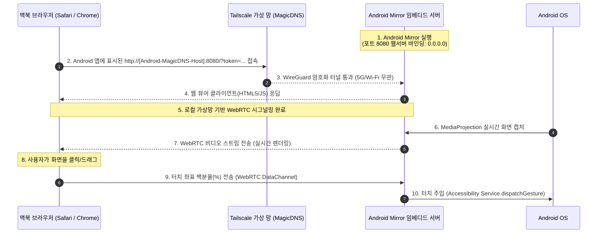

# Android Mirror Web: Tailscale & MagicDNS 기반 무설치 미러링 시스템

본 프로젝트는 맥북에 추가적인 프로그램 설치를 하지 않고(무설치), 기본적으로 Tailscale MagicDNS와 WebRTC를 통해 **Android 스마트폰의 화면을 실시간 미러링하고 맥북의 마우스/키보드로 원격 제어**하기 위한 개인화 솔루션입니다. 같은 Mac에 USB로 직접 연결한 경우에는 ADB port forwarding 기반 USB 모드로 localhost 접속도 지원합니다.

---

## 🛠️ 기술 아키텍처 (Technical Architecture)

본 시스템은 **Tailscale 가상 메시 VPN**과 **MagicDNS**, 그리고 **WebRTC** 및 **안드로이드 접근성 서비스(Accessibility Service)**의 시너지를 극대화하여 구성됩니다.



---

## 🔑 Tailscale & MagicDNS 도입의 핵심 이점

> [!TIP]
> **1. 공인 IP 및 복잡한 도메인 설정 제거 (MagicDNS)**
> 와이파이가 바뀔 때마다 변경되는 로컬 IP(`192.168.x.x`)를 직접 칠 필요 없이, Tailscale이 제공하는 고유 단말기 도메인(예: `http://my-android-phone:8080`)으로 전 세계 어디서든 고정 접속할 수 있습니다.

> [!IMPORTANT]
> **2. 5G/LTE 방화벽 완벽 우회 (Zero Cloud Cost)**
> 모바일 망의 강력한 Symmetric NAT 방화벽을 우회하기 위해 고가의 TURN 서버나 시그널링 서버를 구축할 필요가 없습니다. Tailscale의 DERP 릴레이 인프라가 미디어 데이터 통신을 100% 무료로 자동 우회 중계해 줍니다.

> [!CAUTION]
> **3. 강력한 종단간 군사 규격 보안 (WireGuard)**
> 화면 스트리밍 패킷이 퍼블릭 인터넷에 노출되지 않으며, 사용자 본인의 로그인된 Tailscale 기기(맥북-Android 단말) 사이에서만 암호화 터널을 통해 직접 송수신됩니다.

---

## 📋 핵심 구현 세부 스펙

### 1. Android Mirror 앱 내 임베디드 웹 서버 (Android Host)
* **웹 호스팅:** Ktor(Kotlin) 또는 Javalin(Java) 등의 초경량 자바 웹서버 모듈 탑재.
* **소켓 바인딩:** 외부 및 Tailscale 망의 접속을 허용하기 위해 반드시 `0.0.0.0:8080` 포트로 바인딩.
* **접근성 권한 활용:** 맥북 브라우저로부터 마우스 좌표를 수신하여 다음 코드로 이벤트를 주입합니다.
  ```kotlin
  // 클릭 시뮬레이션 예시 코드
  val path = Path().apply { moveTo(targetX, targetY) }
  val stroke = StrokeDescription(path, 0, 100)
  val gesture = GestureDescription.Builder().addStroke(stroke).build()
  dispatchGesture(gesture, null, null)
  ```

### 2. 맥북 웹 클라이언트 (Mac Viewer)
* **무설치 구동:** macOS 기본 브라우저(Safari, Chrome)를 통해 연결되므로, 별도 앱 배포/설치 및 애플 개발자 계정($99/년) 공증 검증 절차가 불필요합니다.
* **좌표 보정 알고리즘:** 맥북 브라우저 내 가변 뷰포트 크기에 따른 마우스 위치를 안드로이드 원본 해상도(예: 1080 x 2400) 비율 대비 백분율(%) 좌표로 실시간 연산하여 전송합니다.

### 3. 화면 켜짐 유지와 밝기 최소화
* **미러링 중 화면 켜짐 유지:** Android 잠금 또는 화면 꺼짐은 MediaProjection을 중단시킬 수 있습니다. keep-awake 토글은 자동 화면 꺼짐을 줄이는 보조 장치이며, 중단된 경우 Android에서 화면 공유 권한을 다시 승인해야 합니다.
* **밝기 최소화:** Android 로컬 화면 노출을 줄이기 위해 미러링 중 화면 밝기를 최저로 낮추고, 연결 해제 시 이전 밝기와 밝기 모드를 복원합니다. Android의 시스템 설정 수정 권한이 필요합니다.

### 4. 네트워크 기반 스트림 화질
* **자동 기본값:** `AUTO` 화질은 Wi-Fi/Ethernet에서 고화질, 4G/5G 모바일 데이터에서 표준 화질로 동작합니다.
* **수동 조절:** Android 앱과 Mac Viewer에서 `자동`, `저데이터`, `표준`, `고화질` 버튼으로 즉시 전환할 수 있습니다.
* **데이터 절약:** 표준 화질은 `720x1600@15fps`, 저데이터는 `540x1200@12fps`로 캡처 해상도/FPS와 WebRTC bitrate cap을 함께 낮춥니다.
* **Idle 절약:** Viewer 입력이 잠시 없으면 더 낮은 idle 프로필로 내려갔다가, 새 입력이 들어오면 선택한 active 프로필로 복귀합니다.

### 5. Viewer 접근 토큰
* Android 앱 메인 화면에 표시되는 Mac 접속 주소에는 로컬 viewer token이 포함됩니다.
* `/signaling`, `/debug/crash`, 앱 바로가기, 화질 변경 API는 token이 없으면 거부됩니다.
* HTTP 자체는 Tailscale WireGuard 터널 안에서 흐르는 것을 전제로 하며, viewer token은 같은 Tailnet 안의 오조작을 줄이는 추가 안전장치입니다.

---

## 🚥 초기 가동 및 사용 플로우 (User Flow)

1. **사전 준비:**
   * 맥북과 Android 단말기 각각에 **Tailscale** 앱을 설치하고 동일한 계정으로 로그인합니다.
   * Tailscale 관리자 콘솔에서 **MagicDNS** 기능이 켜져 있는지 확인합니다.
   * Android 단말기 설정에서 Android Mirror의 **접근성 서비스(Accessibility Service)** 권한을 활성화합니다.
2. **미러링 개시:**
   * Android Mirror 앱에서 미러링 서버를 켭니다 (포트 `8080`).
   * Tailscale/MagicDNS 또는 USB 직접 연결 중 현재 네트워크 상황에 맞는 접속 주소를 선택합니다.
   * 브라우저에 Android 화면이 실시간으로 송출되며, 마우스로 클릭 및 드래그 제어를 시작합니다.
   * 데이터 사용량이 부담되면 Mac Viewer의 스트림 화질 버튼에서 `표준` 또는 `저데이터`를 선택합니다.
   * 브라우저 연결을 끊었다가 다시 연결하면 Android 14+의 화면 공유 token 재사용 제한 때문에 화면 공유 승인을 다시 요청할 수 있습니다.

### Tailscale / MagicDNS 연결

맥북 브라우저를 열고 Android Mirror 앱 메인 화면에 표시되는 Tailscale URL
(예: `http://pixel-phone:8080/?token=<token>&transport=tailscale`)로 접속합니다.
Tailscale 모드는 `/signaling` WebSocket과 WebRTC 비디오 스트림, `control`
DataChannel을 사용합니다. HTTP 자체는 Tailscale WireGuard 터널 안에서 흐르는 것을
전제로 하며, URL의 viewer token은 같은 Tailnet 안의 오조작을 줄이는 추가
안전장치입니다.

### USB 직접 연결

Tailscale 연결이 불안정하거나 같은 Mac에 USB로 직접 연결한 상태라면 ADB port forwarding으로
Android 내장 서버를 Mac localhost에 노출할 수 있습니다.

```bash
adb forward --remove tcp:8080 || true
adb forward tcp:8080 tcp:8080
```

그 뒤 Mac 브라우저에서 Android 앱 화면의 USB URL
`http://127.0.0.1:8080/?token=<token>&transport=usb`로 접속합니다.
USB 모드는 `/usb/session` WebSocket을 통해 JPEG 화면 frame과 원격 입력 JSON을 전송합니다.
