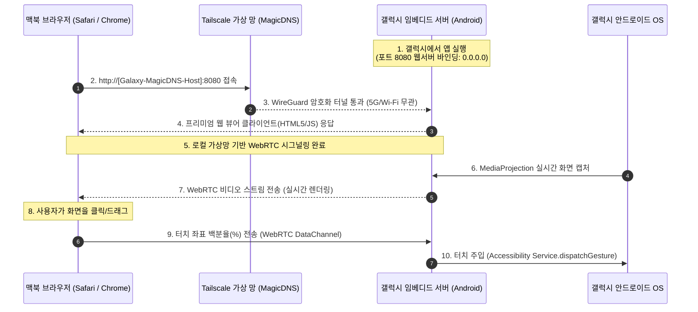

# 🌌 Galaxy Mirror Web: Tailscale & MagicDNS 기반 무설치 미러링 시스템

본 프로젝트는 맥북에 추가적인 프로그램 설치를 하지 않고(무설치), 애플의 개발자 보안 공증 및 5G 셀룰러 환경의 NAT 방화벽을 완벽히 우회하여 **갤럭시 스마트폰의 화면을 실시간 미러링하고 맥북의 마우스로 완벽하게 조작(원격 제어)**하기 위한 개인화 고성능 솔루션입니다.

---

## 🛠️ 기술 아키텍처 (Technical Architecture)

본 시스템은 **Tailscale 가상 메시 VPN**과 **MagicDNS**, 그리고 **WebRTC** 및 **안드로이드 접근성 서비스(Accessibility Service)**의 시너지를 극대화하여 구성됩니다.



---

## 🔑 Tailscale & MagicDNS 도입의 핵심 이점

> [!TIP]
> **1. 공인 IP 및 복잡한 도메인 설정 제거 (MagicDNS)**
> 와이파이가 바뀔 때마다 변경되는 로컬 IP(`192.168.x.x`)를 직접 칠 필요 없이, Tailscale이 제공하는 고유 단말기 도메인(예: `http://my-galaxy-phone:8080`)으로 전 세계 어디서든 고정 접속할 수 있습니다.

> [!IMPORTANT]
> **2. 5G/LTE 방화벽 완벽 우회 (Zero Cloud Cost)**
> 모바일 망의 강력한 Symmetric NAT 방화벽을 우회하기 위해 고가의 TURN 서버나 시그널링 서버를 구축할 필요가 없습니다. Tailscale의 DERP 릴레이 인프라가 미디어 데이터 통신을 100% 무료로 자동 우회 중계해 줍니다.

> [!CAUTION]
> **3. 강력한 종단간 군사 규격 보안 (WireGuard)**
> 화면 스트리밍 패킷이 퍼블릭 인터넷에 노출되지 않으며, 사용자 본인의 로그인된 Tailscale 기기(맥북-갤럭시) 사이에서만 암호화 터널을 통해 직접 송수신되므로 해킹의 위험이 원천 차단됩니다.

---

## 📋 핵심 구현 세부 스펙

### 1. 갤럭시 앱 내 임베디드 웹 서버 (Android Host)
* **웹 호스팅:** Ktor(Kotlin) 또는 Javalin(Java) 등의 초경량 자바 웹서버 모듈 탑재.
* **소켓 바인딩:** 외부 및 Tailscale 망의 접속을 허용하기 위해 반드시 `0.0.0.0:8080` 포트로 바인딩.
* **접근성 권한 활용:** 맥북 브라우저로부터 마우스 좌표를 수신하여 다음 코드로 이벤트를 주입합니다.
  ```kotlin
  // 클릭 시뮬레이션 예시 코드
  val path = Path().apply { moveTo(targetX, targetY) }
  val stroke = StrokeDescription(path, 0, 100)
  val gesture = GestureDescription.Builder().addStroke(stroke).build()
  dispatchGesture(gesture, null, null)
  ```

### 2. 맥북 웹 클라이언트 (Mac Viewer)
* **무설치 구동:** macOS 기본 브라우저(Safari, Chrome)를 통해 연결되므로, 별도 앱 배포/설치 및 애플 개발자 계정($99/년) 공증 검증 절차가 불필요합니다.
* **좌표 보정 알고리즘:** 맥북 브라우저 내 가변 뷰포트 크기에 따른 마우스 위치를 안드로이드 원본 해상도(예: 1080 x 2400) 비율 대비 백분율(%) 좌표로 실시간 연산하여 전송합니다.

---

## 🚥 초기 가동 및 사용 플로우 (User Flow)

1. **사전 준비:**
   * 맥북과 갤럭시 단말기 각각에 **Tailscale** 앱을 설치하고 동일한 계정으로 로그인합니다.
   * Tailscale 관리자 콘솔에서 **MagicDNS** 기능이 켜져 있는지 확인합니다.
   * 갤럭시 단말기 설정에서 본 미러링 앱의 **접근성 서비스(Accessibility Service)** 권한을 활성화합니다.
2. **미러링 개시:**
   * 갤럭시 앱에서 미러링 서버를 켭니다 (포트 `8080`).
   * 맥북 브라우저를 열고 `http://갤럭시단말기명:8080` (예: `http://galaxy-s24:8080`) 주소로 접속합니다.
   * 브라우저에 갤럭시 화면이 실시간으로 부드럽게 송출되며, 마우스로 클릭 및 드래그 제어를 시작합니다.
